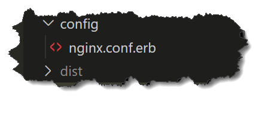
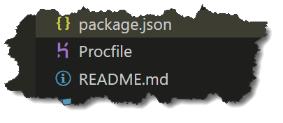

# VueJS CLI static file deployment to Heroku 

> 01-Oct-22 Wolf Scott  (www.ioihan.com)

> If you have comments, suggestions, or any updated information, PLEASE pass it on - or even send a PR if that's easier.

## After the heroku-buildpack-static deprecation

The only constant in life is change the saying goes. Heroku decided to deprecate the **heroku-buildpack-static** build package and while they may have given a warning on this action, I sure didn't see it. It followed right on the heels of their mortarium on publishing code.

The replacement to this build pack was so not an obvious thing for me and took me some digging to find these pieces. If you know of a better way, please do share. I record these settings to hopefully save someone some time AND of course, I pen it here for my future-self as I have several more apps to swap over.

There are several steps to make this work. I am not a big command-line, script, fan when working with Heroku which evidently is frowned upon but these steps will not require any use of the Heroku cli.

I get frustrated quickly with these tutorials that say things like "how to publish..." and such titles and spend 95% of the tutorial showing how to create an app. Not the case here - this is the final stpe(s) only. But, to quote Richard Beverly, we digest.

> **Personal commentary**:  I will say that I'm disapointed in Heroku on this point - their claim, and appeal, has been "easy" and this deployment was SO NOT easy!  Looking at these two files, the result is straight forward.  Perhaps for those brainiacs out there this is a DUH item, but was not so for me.

## What we want to accomplish:

1. Swap out the build pack configuration in the Heroku UI
1. Add 2 configuration files to our project
1. Push the code

NOTE: You can find the code mentioned here in my repo:  

<https://github.com/wolfscott/heroku-vuecli-buildpack-notes>

> *NOTE: I am assuming that the target Dyno is connected to and published from GitHub*. These docs are written from that perspective, and of course, has no connection to the above mentioned repo. 

### Step 1

Let’s start with the build pack.  Log into Heroku and navigate to your Dyno configuration.  You should remove the “Heroku-buildpack-static” build pack and add the “https://buildpack-registry.s3.amazonaws.com/buildpacks/heroku-community/nginx.tgz “ which then will look like this.  If you are unsure how to do this, [x] the old one, and select Add Buildpack button, and paste in the new item above.

If you are setting this up as a new publishing method, just make sure your result looks like this:

This can be found on the **SETTINGS** Tab, mid-page.


### Step 2

The second part of this involves adding two new files to the project.  If you already have these files in your project then I think the task would be to compare the settings carefully as I’ve tried the recommended “defaults” and they did not work for me unmodified.  In fairness, I’m not sure they were supposed to work out of the box, but I was spoiled with the old build pack – it just worked.  

So, the two files are:  (I’ll discuss what goes into them in a moment)

- \Procfile
- \config\nginx.conf.erb

I was thrown by the extension of .erb, but turns out that yep, that extension -IS- required.  **The Procfile has a cap first letter and NO extension**. The other is all lower, just saying.   There was also some mention of a unicorn file which totally messed me up but that file is not required for a VueJS CLI project, as you see the only file in the config folder. (note that that this config is in the root folder and NOT in the \src folder as would be the case for app-level config stuff) 

The pathnames are based on your apps root and in fact for my VueJS cli app, the images show the actual pathnames. You see the package.json and dist folders so that should clarify the “where”. 





**nginx.conf.erb** contents (this handles the nginx related config AND the url rewrite required when refreshing a VueJS SPA application to send all relative paths back to index.html)   I’ve included the config text here and you should be able to quickly find the different parts of interest. (or refer to the repo at the top of this document)

>>NOTE: That I reference the NOTES under the "buildpack" but this is for reference only and this repo is NOT a buildpack compatible entry and entering this repo into the buildpack area will fail. Well, it gets accepted but won't work - :)

``` rb
# 01-Oct-22 :: Wolf Scott ::  wscott@ioihan.com
# -------------------------------------------------------------------------------
# Old Buildpack: https: //github.com/heroku/heroku-buildpack-nginx
# -------------------------------------------------------------------------------
#
# New Docs     : https: //github.com/wolfscott/heroku-vuecli-buildpack-notes
# -------------------------------------------------------------------------------
daemon off;
# Heroku dynos have at least 4 cores.
worker_processes <%= ENV['NGINX_WORKERS'] || 4 %>;

events {
  use epoll;
  accept_mutex on;
  worker_connections <%= ENV['NGINX_WORKER_CONNECTIONS'] || 1024 %>;
}

http {
  gzip on;
  gzip_comp_level 2;
  gzip_min_length 512;
  gzip_proxied any; # Heroku router sends Via header

  server_tokens off;

  log_format l2met 'measure#nginx.service=$request_time request_id=$http_x_request_id';
  access_log <%= ENV['NGINX_ACCESS_LOG_PATH'] || 'logs/nginx/access.log' %> l2met;
  error_log <%= ENV['NGINX_ERROR_LOG_PATH'] || 'logs/nginx/error.log' %>;


  include mime.types;
  default_type application/octet-stream; 
  sendfile on; 

  # Must read the body in 5 seconds.
  client_body_timeout <%= ENV['NGINX_CLIENT_BODY_TIMEOUT'] || 5 %>;

  server {
    listen <%= ENV["PORT"] %>;
    server_name _;
    keepalive_timeout 5;
    client_max_body_size <%= ENV['NGINX_CLIENT_MAX_BODY_SIZE'] || 1 %>M;
    
    location / {

      if ($http_x_forwarded_proto != "https") {
        return 301 https://$host$request_uri;
      }

      alias /app/dist/;
      try_files $uri /index.html;
    }

    root /app/dist; # path to your app
  }
}


```


**Procfile** contents:  (rather simple)

``` text
web: bin/start-nginx-solo
```

And for completeness sake, I have a static.json file that was required in the previous build process, but I do not think this is required for the new method.  I am “guessing” that perhaps this is not required since this information defined in the nginx.conf.erb file, but I include it here for reference.

**static.json** file (not required, just for reference)
``` json
{
  "root": "dist",
  "clean_urls": true,
  "https_only": true,
  "routes": {
    "/**": "index.html"
  }
}
```

### Step 3

Once you have these files in place and ready, you should be good to push by whatever method you normally use to deply your app.

#### Some random notes & observations

- At the time of this writing, the above scripts properly build and deploy my VueJS CLI sites as was perviously handled by the heroku-buildpack-static build package, in production mode without hanging/failing dev dependencies. 

- We are seeking to publish in "production" mode.

- The build defaults to \dist folder, which should be a self-contained "bundle" (not really a bundle but that folder should be able to be easily copied and the dropped into a static site and served).

- The VueJS CLI application, production build, builds to a static site.  Thus, no dev-dependencice should be flagged as "missing" when launching the app.

- Some have mentioned that after deployment that the @vue/cli-service package is not found. I've seen many recommendations, but remember that this package is a development-environment (dev dependency) so if this is being required, you are not serving your new app from the /dist folder, which is a pre-built static resource.


